<a href = "#ubuntu"> Ubuntu </a> <a href ="#fedora">Fedora</a> <a href ="#arch">Arch Linux</a>


 Usado apenas para anotação e facilitação na instalação do LAMP do site: <a href = "https://marcomapa.com/artigos/?p=994"> marcomapa.com/artigos </a>, do site: <a href="https://sempreupdate.com.br/como-instalar-do-lamp-no-ubuntu/"> sempreupdate</a> e do site: <a href = "https://cadernoscicomp.com.br/instalar-lamp-no-antergos-arch-linux/">cadernoscicomp.com.br</a> e do Git do <a href = "https://gist.github.com/pokisin/a294d2993c50c43a579bb09cef66d98d">pokisin</a>.

Para instalar o MariaDB usei a explicação da instalação do LAMP no Ubuntu 16.04 LTS pelo site: <a href="https://sempreupdate.com.br/como-instalar-apache-mariadb-php7-lamp-stack-ubuntu-16-04-lts/"> sempreupdate</a>.

<p id = "ubuntu">


# Como instalar do LAMP no Ubuntu

Na dica de hoje, iremos mostrar o passo a passo de como instalar do **LAMP** no **Ubuntu**. Este processo de instalação funcionar em qualquer versão do Ubuntu. No entanto, pode ser que no nomento em que você for instalar o LAMP no Ubuntu ou distribuição derivada, a versão das imagens já não seja correspondente com a sua. **LAMP** é o acrônimo que refere-se as primeiras letras de:

- **L**inux;
- **A**pache (servidor web);
- **M**ariaDB ou **M**ySQL (software de banco de dados);
- **P**HP (linguagens de programação) ou **P**ython.

Essa combinação de softwares tornou-se popular devido serem gratuitos e de fácil adaptação. Quando usadas juntas, suportam servidores de aplicações web.

###  Passo 0 - Atualização do Sistema Operacional

Recomenda-se que antes de realizar a instalação de qualquer programa no **Linux**, você deve realizar a atualização do mesmo. Para realizar a atualização da lista de repositórios, realize o seguinte comando:

```bash
sudo apt update
```

Para a atualização dos comandos propriamente ditos, execute o comando:

```bash
sudo apt upgrade -y
```

### Passo 1 - Instalação do Apache

```bash
sudo apt install -y apache2
```

Para vermos se ele está ativo basta digitar:

```bash
sudo systemctl status apache2
```

Ele deve retornar algo como isso:

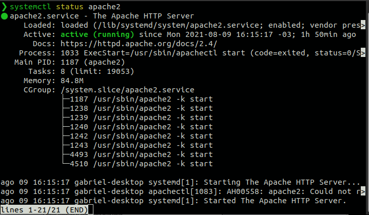

Se ele aparecer com o "Active: active(running)" é porque está funcionando certinho, caso não apareça basta iniciar ele:

```bash
sudo systemctl start apache2
```

E depois testar de novo para ver se ele foi ativado:

```bash
sudo systemctl status apache2
```

Para fazer com que ele inicie junto do sistema, basta digitar:

```bash
sudo systemctl enable apache2
```

Para testar se o **Apache** está funcionando corretamente, devemos digitar **<a href = "http://localhost/">localhost</a>** na barra de endereços do navegador de sua preferência. Tal mensagem deverá aparecer:

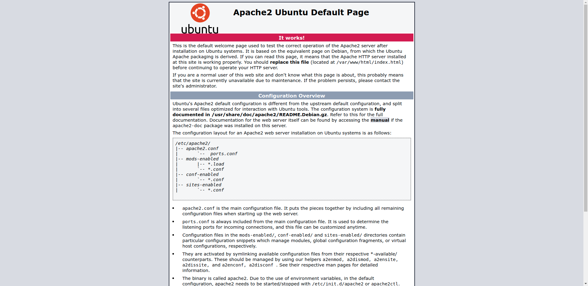

### Passo 2 - Instação do PHP

Para instalação do **PHP** juntamente com suas dependências:

```bash
sudo apt install -y php php-cli php-common php-gd php-mbstring php-intl php-xml php-zip php-pear libapache2-mod-php
```

Para criar uma página de teste **PHP**:

```bash
echo “<?php phpinfo(); ?>” | sudo tee /var/www/html/test.php | sudo service apache2 restart
```

Para testar o **PHP** no navegador, digite na página de endereços: **<a href = "http://localhost/test.php"> localhost/test.php</a>.**

Tal janela irá aparecer:

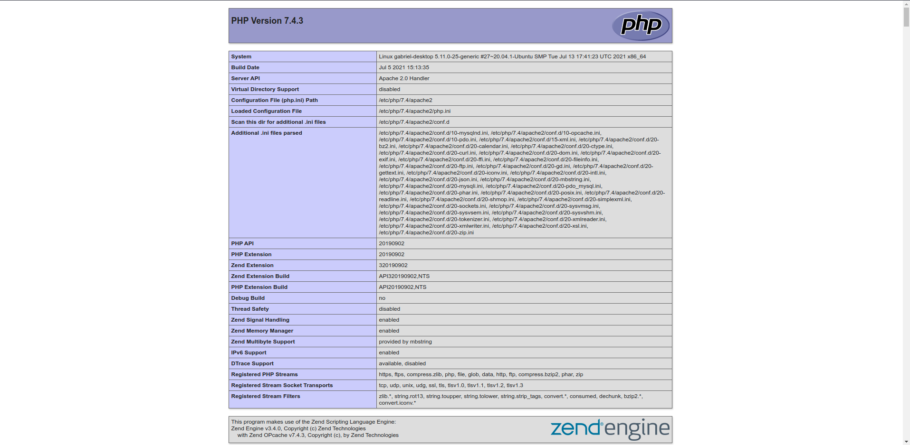

Caso aparece uma tela em branco, basta editar o arquivo test.php:

```bash
sudo nano /var/www/html/test.php
```

E depois adicionar o código em PHP para testar a página caso o comando anterior não tenha escrito no arquivo:

```php
<?php

phpinfo();

?>
```

E depois so reiniciais o apache:

```bash
sudo service apache2 restart
```

### Passo 3 - Instação e Configuração do Mysql

Neste caso não vamos instalar o MySQL Server, e sim o MariaDB Server por ser mais completo. MariaDB é uma substituição drop-in para o MySQL. Ele é desenvolvido por ex-membros da equipe do MySQL que se preocupam que a Oracle possa transformar o MySQL em um produto de código fechado. Muitas distribuições e empresas Linux migraram para MariaDB. Então vamos instalar o MariaDB em vez do MySQL.

```bash
sudo apt-get install mariadb-server mariadb-client
```

**Depois de instalado, o servidor MariaDB geralmente é iniciado automaticamente. Use systemctl para verificar seu status:**

```bash
systemctl status mysql
```

**Exemplos de saída:**

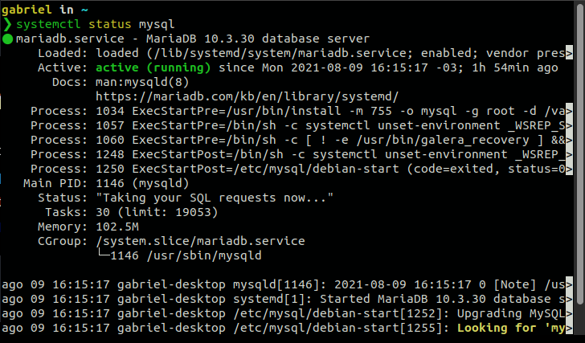

**Se não estiver em execução, inicie-o com este comando:**

``` bash
sudo systemctl start mysql
```

Para ativar o MariaDB automaticamente quando o Ubuntu for reinicializado execute o comando abaixo:

```bash
sudo systemctl enable mysql
```

**Agora execute o script de segurança pós-instalação:**

```bash
sudo mysql_secure_installation
```

Com isso, aparecerá no terminal o setup para que você possa configurar a senha root. Observe a linha:

```bash
‘Change the root password? [Y/n] y ‘
```

Pressione a tecla **'y'** e dê um enter, (caso seu Linux esteja em português, substitua o ‘y’ por ‘s’).

```
New password:
```

Digite para criar sua senha root e dê enter

```
Re-enter new password:
```

Redigite a sua senha criada no passo anterior e dê um novo enter.

```
Password updated successfully!
```

Pronto ! Sua senha root agora está configurada 🙂

Para acessar o console do [Mysql](https://sempreupdate.com.br/?s=mysql) pelo terminal:

```bash
sudo mysql -u root -p
```

E digite a senha que você configurou para o MariaDB.

O terminal mudará como mostra a figura:

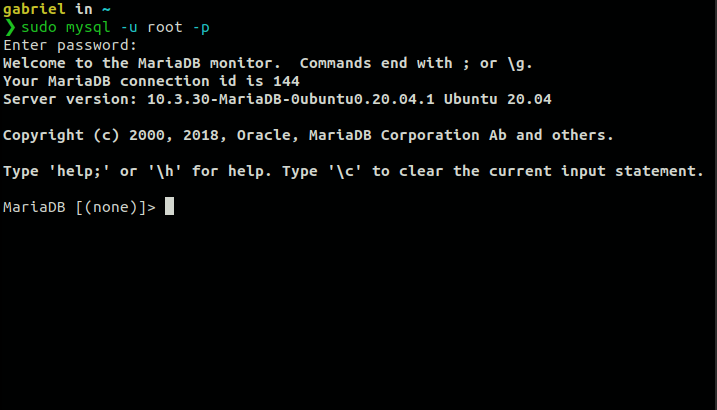

Agora, iremos testar os comandos básicos no terminal. Primeiramente mostrar os bancos de dados:

```mysql
show databases;
```

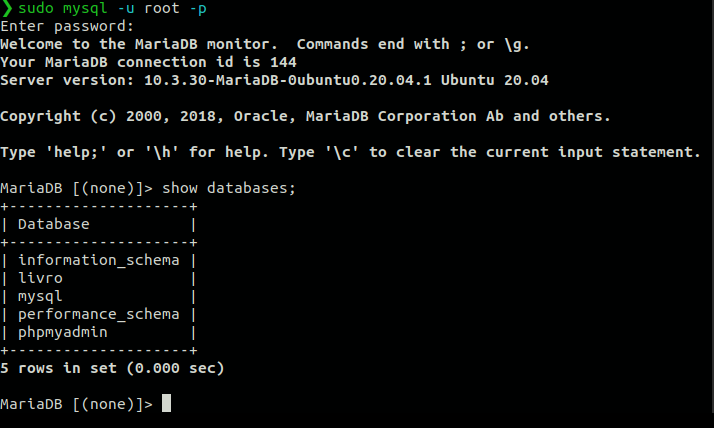

Para criar um novo banco de dados de nome meu_banco:

```mysql
create database meu_banco;
```

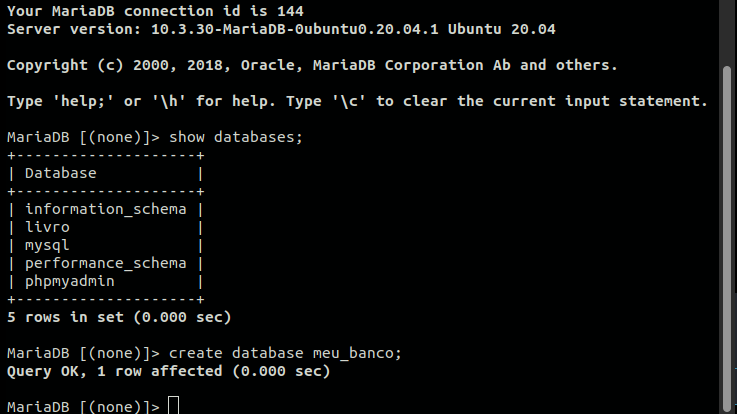


Digite o primeiro comando novamente para ver ele no seus bancos de dados:

```mysql
show databases;
```

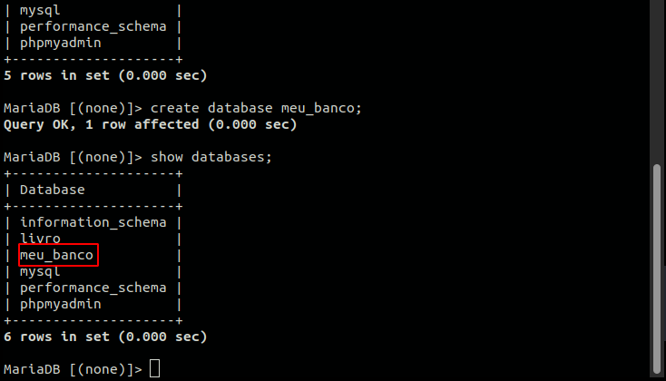

Para apagar o banco de dados de nome meu_banco:

```mariadb
drop database meu_banco;
```

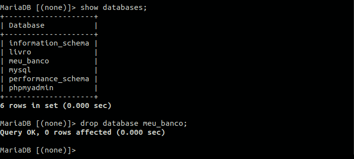

E confira os bancos de dados novamente:

```mariadb
show databases;
```

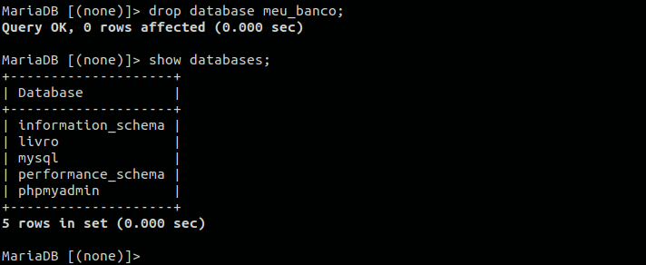


### Criando um novo usuário para banco de dados MySQL:

Ainda na interface do MySQL/MariaDB, vamos agora criar um novo usuário para gerenciar seus bancos de dados, como padrão tem o usuário 'root' do linux, que é oque tem permissão total sobre o sistema, mas se você prefere criar o seu próprio usuário, basta digitar:

```mysql
create user 'seu_usuario'@'localhost' identified by 'sua_senha';
```

E depois dar permissão total para todos os bancos de dados para o usuário que você criou:

```mariadb
grant all privileges on *.* to 'seu_usuario'@'localhost' with grant option;
```

Exemplo:

```mysql
create user 'gabriel'@'localhost' identified by 'gabriel123';
```

```mariadb
grant all privileges on *.* to 'gabriel'@'localhost' with grant option;
```

Caso você queirar criar um usuário que tenha permisão a apenas algum/alguns bancos de dados, digite:

``` mysql
grant all privileges on meu_banco.* to 'gabriel'@'localhost' with grant option;
```

Nesse caso, o meu usuário para o banco de dados vai ter acesso apenas ao banco de dados "meu_banco", todos os outros bancos de dados que você criar so poderam ser acessados pelo usuário "root", ou algum outro usuário que você tenha dado permissão total aos bancos de dados.

Finalizadas as permissões, você deve definir para os seus novos usuários os privilégios para manipulação do Banco de Dados. Então, sempre recarregue todos os privilégios.

```mariadb
flush privileges;
```


Caso você queira ver todos os usuários que tem para os bancos de dados e as conexões de cada um, basta digitar:

```mariadb
select user, host from mysql.user;
```

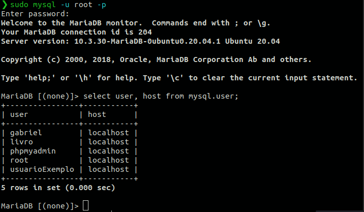

Caso você queira apagar algum usuário basta digitar:

```mariadb
drop user 'usuarioExemplo'@'localhost';
```

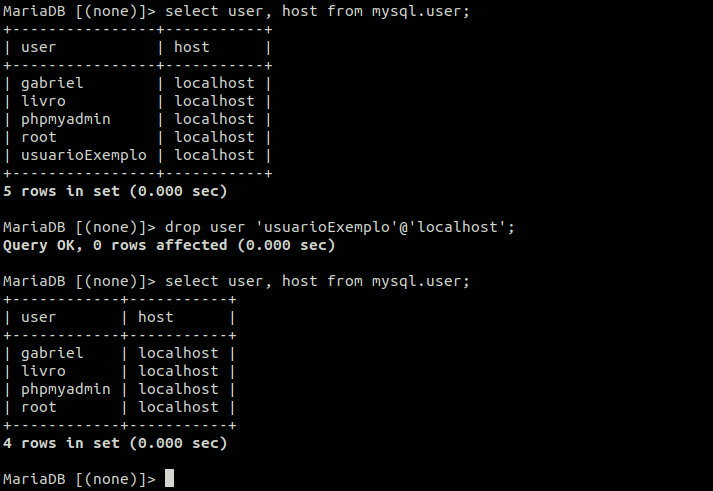

Ou também podemos realizar a deleção do usuário com o comando delete:

```mariadb
delete from mysql.user where user = 'usuarioExemplo';
```

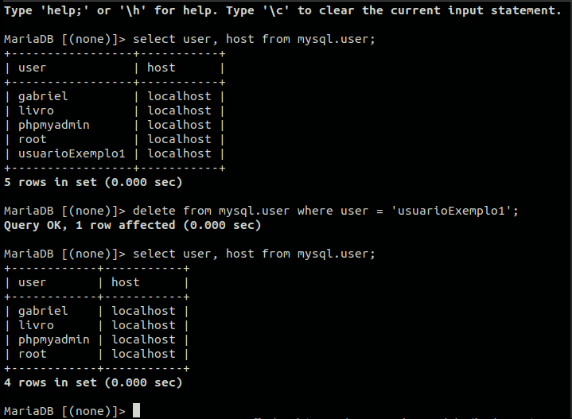

E o usuário que você escolheu será deletado.

Saia do **MySQL** com o comando **exit;** ou com o jogo de teclas **Control+d.** Depois, entre com seu novo usuário novamente no terminal do sistema operacional:

```bash
sudo mysql -u seu_usuario -p
```

Digite a senha que você registrou no MySQL.

### Passo 4 - Instalação e configuração do phpMyAdmin

Instalação e configuração do **phpMyAdmin**

```bash
sudo apt install -y phpmyadmin
```

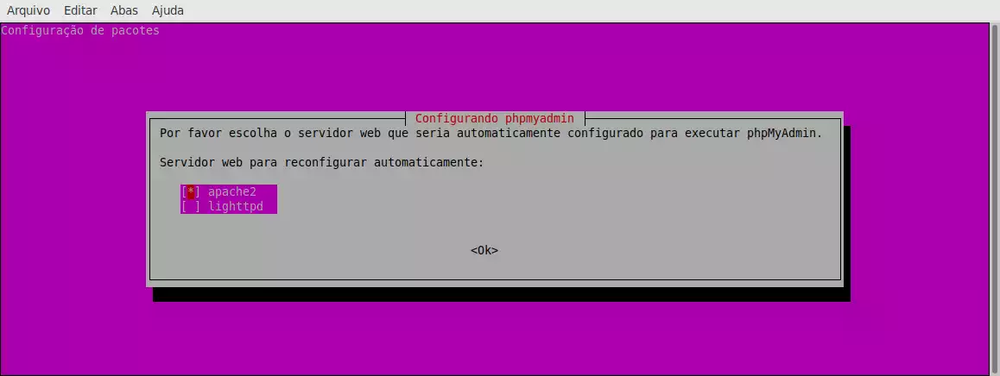

Marque a opção **apache2** usando a tecla **ESPAÇO** e mover até o **OK** com a tecla **TAB**.

Depois selecione **sim:**

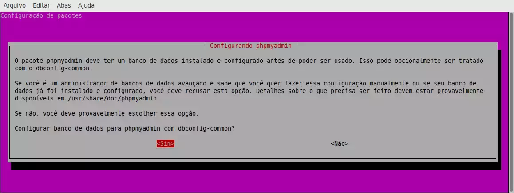

Caso necessite, utilize selecione uma senha para **phpMyAdmin**. Para testá-lo no navegador, digite na barra de endereços: **<a href = "http://localhost/phpmyadmin/">localhost/phpmyadmin</a>**.

A seguinte tela irá ser exibida:

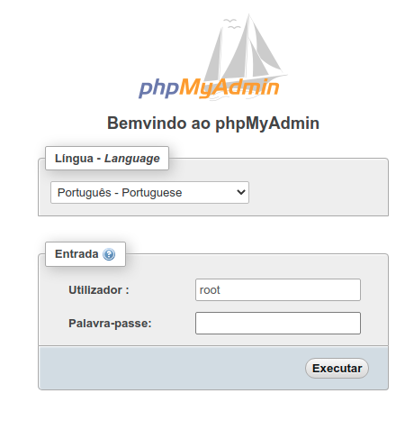

Digite seu usuário e senha registrados na configuração do **MySQL**. Caso você queira entrar com o root, use a senha que você criou da parte da configuração do MySQL com o comando "sudo mysql_secure_installation", e se mesmo assim não entrar no phpMyAdmin, crie um usuário com o nome "root" no MySQL e de permissão total para ele.

</p>

<p id = "fedora">


Instalando Servidor Apache, MySQL e PHP (LAMP) no Linux (Fedora, Red Hat e CentOS)
===================================================================================

Todo desenvolvedor Web precisa de um ambiente de testes, pro pessoal que trabalha com Windows, as opções são o ISS da Microsoft, ou o WAMP que é a versão do LAMP para ambiente Microsoft.

Nunca me pareceu muito prático testar aplicações Web no Windows, já que a grande maioria dos servidores no mundo são Linux, sempre mantive uma máquina virtual com ISS configurado apenas para testar aplicações ASP e seus derivados, mas como a maior parte de meu trabalho sempre esteve no PHP e MySQL, o Linux acabou ganhando preferência no meu dia a dia.

Vamos aprender a instalar os serviços, lembrando que o aprendido aqui também vale para colocar um servidor Web em produção, claro que pouco conveniente, pois hoje os custos de hospedagens profissionais estão cada vez mais baixos, não justificando o investimento em infra para manter um servidor ligado 24 horas hospedando um site pessoal.

O primeiro passo para iniciarmos a instalação, é abrir o terminal, e em seguida logar como usuário root, digitando:

```bash
 su
```

dê um enter.

agora insira sua senha de root, configurada quando você instalou sua distro Linux no seu computador.

Após feito isso, vamos iniciar instalando o Apache, com o comando:

```bash
dnf install httpd -y
```

Caso sua máquina esteja utilizando alguma versão anterior do Fedora, o comando retornará erro, então, substitua o ‘dnf’ por ‘yum’, ficando assim:

```bash
yum install httpd -y
```

Agora vamos ativar o serviço de httpd para iniciar automaticamente em cada inicialização do seu sistema operacional:

```bash
systemctl enable httpd
```

Iniciando o serviço httpd pela 1ª vez usando o seguinte comando:

```bash
systemctl start httpd
```

Como nem tudo é perfeito, pode aparecer o seguinte erro:

```bash
‘Job for httpd.service failed. See 'systemctl status httpd.service' and
'journalctl -xn' for details.’
```

Para resolver, elimine todo o conteúdo encontrado em ‘/ etc / hostname’ .
Coloque "Localhost" em "Servername" em ‘/ etc / httpd / conf / httpd.conf’ e ajuste o firewall para permitir que o serviço httpd seja acessado de clientes remotos, utilizando os seguintes comandos:

```bash
firewall-cmd --permanent –add-service=http
```

e

```bash
firewall-cmd --permanent –add-service=https
```

Reinicie o serviço de seu Firewall:

```bash
firewall-cmd --reload
```

suba o serviço httpd, utilizando:

```bash
systemctl start httpd
```

Feito isso, seu Apache já está rodando na máquina, para testar, abra um navegador Web e digite na barra de endereços:

### <b> http://seu-ip/ (sabendo que ‘seu-ip’ é o nº de seu IP em sua rede local) </b>

ou

### <b> http://localhost/ </b>

ou ainda:

### <b> http://127.0.0.1/ </b> 

Você visualizará a tela Padrão do Servidor Apache. Terminando assim a 1ª parte de nosso trabalho.


*****

## Vamos agora instalar o serviço de Banco de Dados MySQL. Como opção prática e robusta, recomendo o MariaDB.

Para instalá-lo, vamos dar este comando no terminal:

```bash
dnf install mariadb mariadb-server -y
```

Assim como no caso da instalação do Apache, caso a versão de sua distro retorne erro, utilize:

```bash
yum install mariadb mariadb-server -y
```

Após a instalação, vamos ativar o início automático dos serviços, sempre que o computador seja ligado:

```bash
systemctl enable mariadb
```

E iniciá-lo pela 1ª vez:

```bash
systemctl start mariadb
```

O próximo passo é Definir a senha Root de seus bancos MySQL, pois por padrão, ela fica em branco após a instalação, possibilitando o fácil acesso aos databases criados.

Aplique o comando:

```bash
mysql_secure_installation
```

Com isso, aparecerá no terminal o setup para que você possa configurar a senha root. Observe a linha:

```bash
‘Change the root password? [Y/n] y ‘
```

Pressione a tecla <b> 'y' </b> e dê um enter, (caso seu Linux esteja em português, substitua o ‘y’ por ‘s’).

```bash
New password:
```

Digite para criar sua senha root e dê enter

```bash
Re-enter new password:
```

Redigite a sua senha criada no passo anterior e dê um novo enter.

```bash
Password updated successfully!
```

Pronto ! Sua senha root agora está configurada 🙂
*****
## Agora só está faltando instalarmos o serviço PHP

Utilizaremos o comando:

```bash
dnf install php -y
```

Ou no caso de versão anterior do Linux:

```bash
yum install php -y
```

Feito isso, vamos testá-lo.

Vamos criar um arquivo chamado ‘testphp.php’ na pasta principal da instalação do Apache:

```bash
vi /var/www/html/testphp.php
```

Adicione as seguintes linhas de código:

```php
<?php

phpinfo();

?>
```

Reinicie o serviço httpd:

```bash
systemctl restart httpd
```

Agora, de volta no seu navegador vamos digitar na barra de endereços:

### <b> http://localhost/testphp.php </b>

Será exibido todos os detalhes sobre o PHP como a versão, data de construção e comandos, além de outros recursos.

Vamos instalar o módulo php-mysql com o seguinte comando:

```bash
dnf install php-mysqli -y
```

ou

```bash
yum install php-mysqli -y
```

Sempre que você instalar algum novo módulo, lembre-se de reiniciar o serviço utilizando:

```bash
systemctl restart httpd
```
*****

## E para finalizarmos, vamos instalar um ambiente gráfico para gerenciarmos nossos Bancos de Dados. E para tal tarefa, nada melhor do que nosso querido phpMyAdmin 😀

```bash
dnf install phpmyadmin -y
```

ou

```bash
yum install phpmyadmin -y
```

Por padrão, o phpMyAdmin pode ser acessado apenas de seu localhost. Para acessá-lo de uma máquina em sua rede, execute os seguintes passos.

Edite o arquivo ‘/etc/httpd/conf.d/phpMyAdmin.conf’:

```bash
vi /etc/httpd/conf.d/phpMyAdmin.conf
```

Localize os trechos:

```bash
<RequireAny>

Require ip 127.0.0.1

Require ip ::1

Require all granted

</RequireAny>
```

Altere para :

```bash
<RequireAny>

#Require ip 127.0.0.1

#Require ip ::1

Require all granted

</RequireAny>
```

Observação. Existe mais de um único trecho neste arquivo onde você precisará fazer esta alteração.

Salve e feche este arquivo de configuração e Reinicie seu o serviço:

```bash
systemctl restart httpd
```

Agora é só testar seu serviço phpMyAdmin. Na barra de endereços em seu navegador, digite:

### <b>  http://localhost/phpmyadmin </b>

Você será direcionado para a tela de login do ambiente. Nesta tela, você deve entrar com o usuário root e a senha que você definiu na configuração do MariaDB.

Pronto, seu LAMP está preparado para o uso. Você pode agora criar ou importar seus bancos, e testar seus fontes com muita facilidade.

</p>

<p id = "arch">


# [Instalar LAMP no Antergos (Arch Linux)](https://cadernoscicomp.com.br/instalar-lamp-no-antergos-arch-linux/)

## Instalando o Apache

Para instalar o Apache abra o terminal e digite:

```bash
sudo pacman -S apache
```

Para iniciar o Apache digite:

```bash
sudo systemctl start httpd
```

Caso queira colocar o Apache para iniciar com o sistema digite

```bash
sudo systemctl enable httpd
```

Testando o Apache:

Agora para testar o Apache abra o seu navegador e na barra de endereços simplesmente digite *localhost* deve aparecer algo semelhante a figura abaixo:

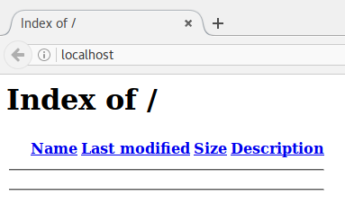

Se apareceu uma página de erro 403 edite o arquivo *httpd.conf* comentando a seguinte linha colocando a cerquilha(#) antes dela:

> #LoadModule unique_id_module modules/mod_unique_id.so

Agora vamos criar um simples arquivo html no diretório padrão do Apache que fica em /srv/http, então navegue até esse diretório com:

```bash
cd /srv/http
sudo nano index.html
```

E cria o arquivo conforme abaixo:

```html
<html>
<head> 
   <title>Teste do Apache</title>
</head>
<body>
   <h1>Apache Funcionando</h1>
</body>
</html>
```

No seu navegador regarregue *localhost* e você deve ver algo como a figura abaixo:

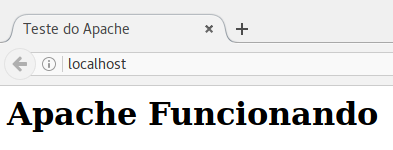

## Instalando o Myslq

Na verdade o que você vai instalar é o MariaDB que tem perfeita compatibilidade com o MySql. Para instala-lo digite:

```bash
sudo pacman -S mysql
```

Irá aparecer uma escolha de opções entre o próprio *mariadb* da distribuição e o pacote *percona-server*:

Digite um número (padrão=1):

Aqui nós deixamos o padrão.

Para iniciar o MariaDB de o seguinte comando:

```bash
sudo systemctl start mysqld
```

Caso apareça a seguinte mensagem de erro:

> Job for mariadb.service failed because the control process exited with error code.
> See “systemctl status mariadb.service” and “journalctl -xe” for details.

de o seguinte comando no terminal:

```bash
sudo mysql_install_db --user=mysql --basedir=/usr/ --ldata=/var/lib/mysql/
```

Da mesma forma que no apache se desejar incluir o MariaDB na inicialização do sistema digite:

```bash
sudo systemctl enable mysqld
```

Agora vamos concluir a instalação com segurança digitando o comando abaixo:

```bash
sudo mysql_secure_installation
```

aqui logo no início será pedida a senha para o usuário do banco de dados de apenas *enter* (o usuário é o root e a sua senha ainda não foi definida) logo após será pedido que você entre com uma nova senha para o usuário digite a senha que desejar e confirme logo depois basta dar *enter* até o final.

## Instalando o PHP

Simplesmente digite no terminal

```bash
sudo pacman -S php php-apache
```

Veja a vesão da sua instalação do PHP com o seguinte comando:

```bash
php --version
```

### Vamos configurar o Apache para funcionar em conjunto com o PHP:

```bash
  sudo nano /etc/httpd/conf/httpd.conf
```

- Vamos comentamos ou substituir a linha:

  > LoadModule mpm_event_module modules/mod_mpm_event.so 

  com o seguinte:

  > LoadModule mpm_prefork_module modules/mod_mpm_prefork.so

- Posteriormente, no final do mesmo arquivo, adicionamos o seguinte bloco se você usar php5:

  ```bash
  # Use for PHP 5.x:
  LoadModule php5_module modules/libphp5.so
  AddHandler php5-script php
  Include conf/extra/php5_module.conf
  
  # para cargar los index.php si se encuentran en el directorio
  <IfModule dir_module>
    <IfModule php5_module>
    	DirectoryIndex index.php index.html
    	<FilesMatch "\.php$">
    		SetHandler application/x-httpd-php
    	</FilesMatch>
    	<FilesMatch "\.phps$">
    		SetHandler application/x-httpd-php-source
    	</FilesMatch>
    </IfModule>
  </IfModule>
  ```

+ Se você estiver usando o php7 adicione o seguinte bloco de código:

  ```bash
  # Use for PHP 7.x:
  LoadModule php7_module modules/libphp7.so
  AddHandler php7-script php
  Include conf/extra/php7_module.conf
  
  # para cargar los index.php si se encuentran en el directorio
  <IfModule dir_module>
    <IfModule php7_module>
    	DirectoryIndex index.php index.html
    	<FilesMatch "\.php$">
    		SetHandler application/x-httpd-php
    	</FilesMatch>
    	<FilesMatch "\.phps$">
    		SetHandler application/x-httpd-php-source
    	</FilesMatch>
    </IfModule>
  </IfModule>
  ```

+ Se você estiver usando o php8 adicione o seguinte bloco de código:

  ```bash
  # Use for PHP 8.x:
  LoadModule php_module modules/libphp.so
  AddHandler php-script php
  Include conf/extra/php_module.conf
  
  # para cargar los index.php si se encuentran en el directorio
  <IfModule dir_module>
    <IfModule php_module>
    	DirectoryIndex index.php index.html
    	<FilesMatch "\.php$">
    		SetHandler application/x-httpd-php
    	</FilesMatch>
    	<FilesMatch "\.phps$">
    		SetHandler application/x-httpd-php-source
    	</FilesMatch>
    </IfModule>
  </IfModule>
  ```

  E finalmente reinicie o Apache:

  ```bash
  sudo systemctl restart httpd
  ```

  Vamos agora testar o PHP para isso crie um arquivo de nome *info.php:*

  ```php
  <?php
  phpinfo();
  ?>
  ```

  e coloque ou no diretório */srv/http* ou em sua *public_html*. Para testa-lo basta digitar na barra de endereços localhost/info.php ou localhost/~seu_nome_usuario/info.php sua saída deve ser semelhante a:

  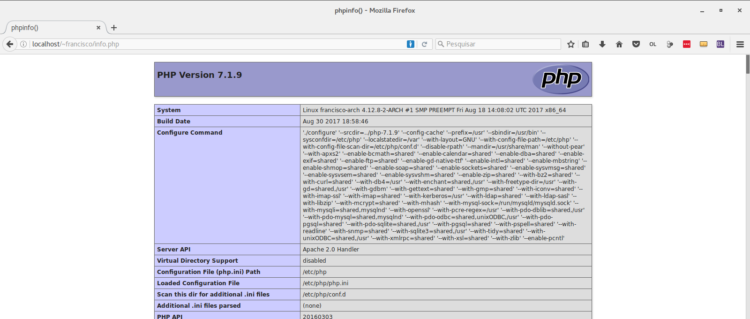

</p>
