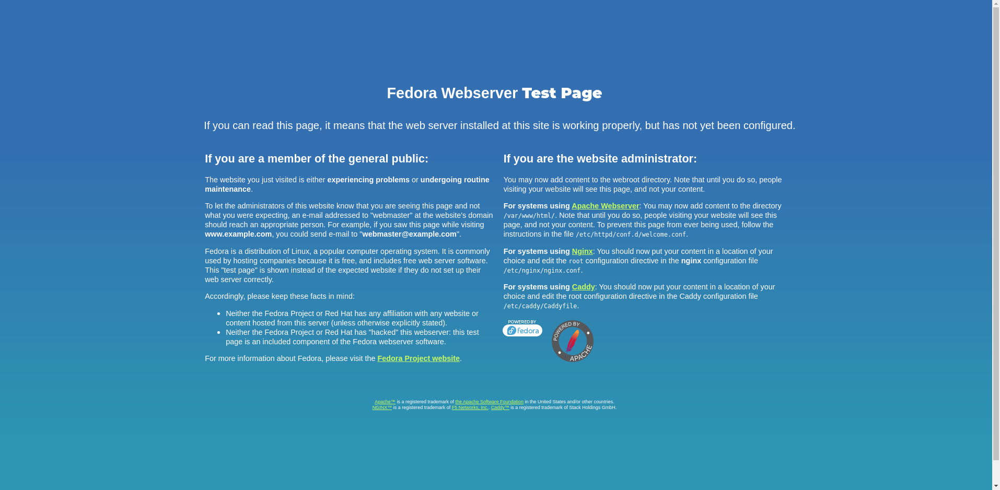

Instalando Servidor Apache, MySQL e PHP (LAMP) no Linux (Fedora, Red Hat e CentOS)
===================================================================================

Todo desenvolvedor Web precisa de um ambiente de testes, pro pessoal que trabalha com Windows, as opções são o ISS da Microsoft, ou o WAMP que é a versão do LAMP para ambiente Microsoft.

Nunca me pareceu muito prático testar aplicações Web no Windows, já que a grande maioria dos servidores no mundo são Linux, sempre mantive uma máquina virtual com ISS configurado apenas para testar aplicações ASP e seus derivados, mas como a maior parte de meu trabalho sempre esteve no PHP e MySQL, o Linux acabou ganhando preferência no meu dia a dia.

Vamos aprender a instalar os serviços, lembrando que o aprendido aqui também vale para colocar um servidor Web em produção, claro que pouco conveniente, pois hoje os custos de hospedagens profissionais estão cada vez mais baixos, não justificando o investimento em infra para manter um servidor ligado 24 horas hospedando um site pessoal.

O primeiro passo para iniciarmos a instalação, é abrir o terminal, e em seguida logar como usuário root, digitando:

```
 su
```

dê um enter.

agora insira sua senha de root, configurada quando você instalou sua distro Linux no seu computador.

Após feito isso, vamos iniciar instalando o Apache, com o comando:

```
dnf install httpd -y
```

Caso sua máquina esteja utilizando alguma versão anterior do Fedora, o comando retornará erro, então, substitua o ‘dnf’ por ‘yum’, ficando assim:

```
yum install httpd -y
```

Agora vamos ativar o serviço de httpd para iniciar automaticamente em cada inicialização do seu sistema operacional:

```
systemctl enable httpd
```

Iniciando o serviço httpd pela 1ª vez usando o seguinte comando:

```
systemctl start httpd
```

Como nem tudo é perfeito, pode aparecer o seguinte erro:

```
‘Job for httpd.service failed. See 'systemctl status httpd.service' and
'journalctl -xn' for details.’
```

Para resolver, elimine todo o conteúdo encontrado em ‘/ etc / hostname’ .
Coloque "Localhost" em "Servername" em ‘/ etc / httpd / conf / httpd.conf’ e ajuste o firewall para permitir que o serviço httpd seja acessado de clientes remotos, utilizando os seguintes comandos:

```
firewall-cmd --permanent –add-service=http
```

e

```
firewall-cmd --permanent –add-service=https
```

Reinicie o serviço de seu Firewall:

```
firewall-cmd --reload
```

suba o serviço httpd, utilizando:

```
systemctl start httpd
```

Feito isso, seu Apache já está rodando na máquina, para testar, abra um navegador Web e digite na barra de endereços:

### <b> http://seu-ip/ (sabendo que ‘seu-ip’ é o nº de seu IP em sua rede local) </b>

ou

### <b> http://localhost/ </b>

ou ainda:

### <b> http://127.0.0.1/ </b> 

Você visualizará a tela Padrão do Servidor Apache. Terminando assim a 1ª parte de nosso trabalho.



## Vamos agora instalar o serviço de Banco de Dados MySQL. Como opção prática e robusta, recomendo o MariaDB.

Para instalá-lo, vamos dar este comando no terminal:

```
dnf install mariadb mariadb-server -y
```

Assim como no caso da instalação do Apache, caso a versão de sua distro retorne erro, utilize:

```
yum install mariadb mariadb-server -y
```

Após a instalação, vamos ativar o início automático dos serviços, sempre que o computador seja ligado:

```
systemctl enable mariadb
```

E iniciá-lo pela 1ª vez:

```
systemctl start mariadb
```

O próximo passo é Definir a senha Root de seus bancos MySQL, pois por padrão, ela fica em branco após a instalação, possibilitando o fácil acesso aos databases criados.

Aplique o comando:

```
mysql_secure_installation
```

Com isso, aparecerá no terminal o setup para que você possa configurar a senha root. Observe a linha:

```
‘Change the root password? [Y/n] y ‘
```

Pressione a tecla <b> 'y' </b> e dê um enter, (caso seu Linux esteja em português, substitua o ‘y’ por ‘s’).

```
New password:
```

Digite para criar sua senha root e dê enter

```
Re-enter new password:
```

Redigite a sua senha criada no passo anterior e dê um novo enter.

```
Password updated successfully!
```

Pronto ! Sua senha root agora está configurada 🙂

## Agora só está faltando instalarmos o serviço PHP

Utilizaremos o comando:

```
dnf install php -y
```

Ou no caso de versão anterior do Linux:

```
yum install php -y
```

Feito isso, vamos testá-lo.

Vamos criar um arquivo chamado ‘testphp.php’ na pasta principal da instalação do Apache:

```
vi /var/www/html/testphp.php
```

Adicione as seguintes linhas de código:

```php
<?php

phpinfo();

?>
```

Reinicie o serviço httpd:

```
systemctl restart httpd
```

Agora, de volta no seu navegador vamos digitar na barra de endereços:

### <b> http://localhost/testphp.php </b>

Será exibido todos os detalhes sobre o PHP como a versão, data de construção e comandos, além de outros recursos.

Vamos instalar o módulo php-mysql com o seguinte comando:

```
dnf install php-mysqli -y
```

ou

```
yum install php-mysqli -y
```

Sempre que você instalar algum novo módulo, lembre-se de reiniciar o serviço utilizando:

```
systemctl restart httpd
```

## E para finalizarmos, vamos instalar um ambiente gráfico para gerenciarmos nossos Bancos de Dados. E para tal tarefa, nada melhor do que nosso querido phpMyAdmin 😀

```
dnf install phpmyadmin -y
```

ou

```
yum install phpmyadmin -y
```

Por padrão, o phpMyAdmin pode ser acessado apenas de seu localhost. Para acessá-lo de uma máquina em sua rede, execute os seguintes passos.

Edite o arquivo ‘/etc/httpd/conf.d/phpMyAdmin.conf’:

```
vi /etc/httpd/conf.d/phpMyAdmin.conf
```

Localize os trechos:

```vim
<RequireAny>

Require ip 127.0.0.1

Require ip ::1

Require all granted

</RequireAny>
```

Altere para :

```vim
<RequireAny>

#Require ip 127.0.0.1

#Require ip ::1

Require all granted

</RequireAny>
```

Observação. Existe mais de um único trecho neste arquivo onde você precisará fazer esta alteração.

Salve e feche este arquivo de configuração e Reinicie seu o serviço:

```
systemctl restart httpd
```

Agora é só testar seu serviço phpMyAdmin. Na barra de endereços em seu navegador, digite:

### <b>  http://localhost/phpmyadmin </b>

Você será direcionado para a tela de login do ambiente. Nesta tela, você deve entrar com o usuário root e a senha que você definiu na configuração do MariaDB.

Pronto, seu LAMP está preparado para o uso. Você pode agora criar ou importar seus bancos, e testar seus fontes com muita facilidade.

### <b> Usado apenas para anotação e facilitação na instalação do LAMP do site: [marcomapa.com/artigos](/https://marcomapa.com/artigos/?p=994)
